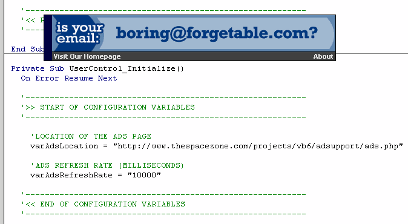



## AdSupport

### Description

Want to keep your programs free, yet still want a way to make some money off of them? Then support your programs with built-in advertising! This user control can be built in to the program, or in a seperate pop-up window as seen in the screen shot. Ads are seperate from the program, and can be updated easily. Instructions are in the code, all you have to do is edit 2 variables, and your done! For the latest version go to:

http://www.thespacezone.com/projects/vb6/adsupport/index.php

New versions with more features/bug fixes are uploaded daily.
 
### More Info
 

             |
---                |---
**Submitted On**   |2001-02-27 00:16:26
**By**             |[jroot](https://github.com/Planet-Source-Code/PSCIndex/blob/master/ByAuthor/jroot.md)
**Level**          |Intermediate
**User Rating**    |4.3 (26 globes from 6 users)
**Compatibility**  |VB 5\.0, VB 6\.0
**Category**       |[Internet/ HTML](https://github.com/Planet-Source-Code/PSCIndex/blob/master/ByCategory/internet-html__1-34.md)
**World**          |[Visual Basic](https://github.com/Planet-Source-Code/PSCIndex/blob/master/ByWorld/visual-basic.md)
**Archive File**   |[CODE\_UPLOAD155262272001\.zip](https://github.com/Planet-Source-Code/jroot-adsupport__1-21350/archive/master.zip)

